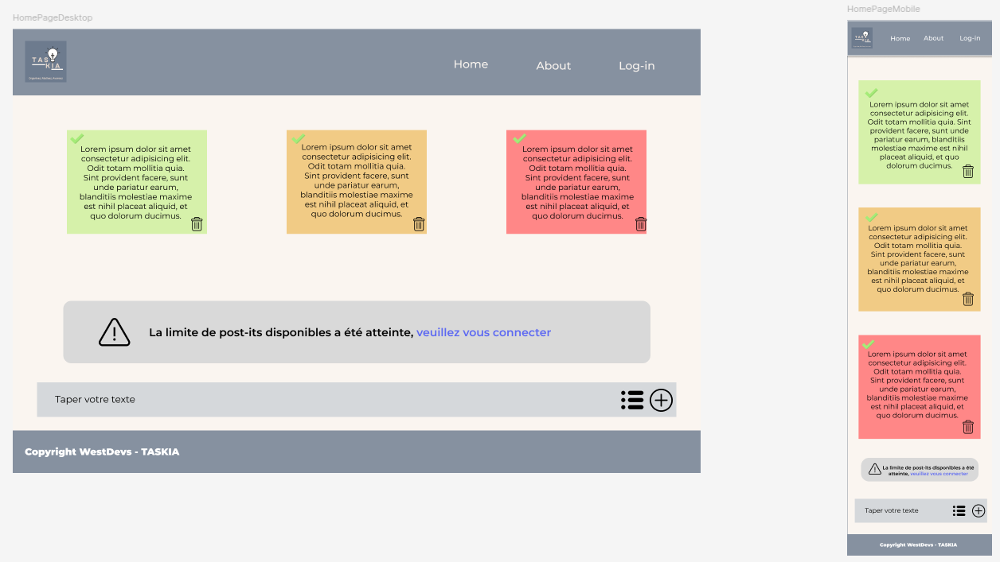
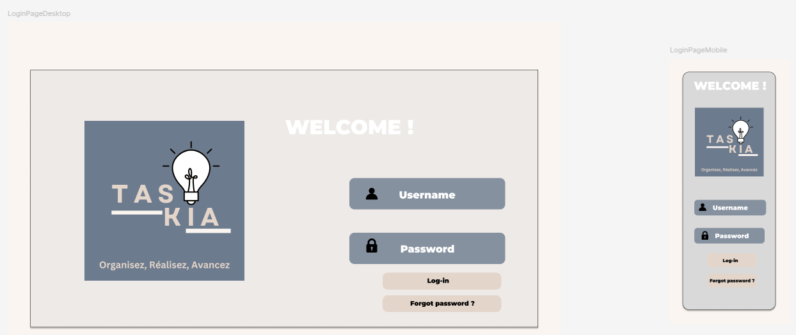
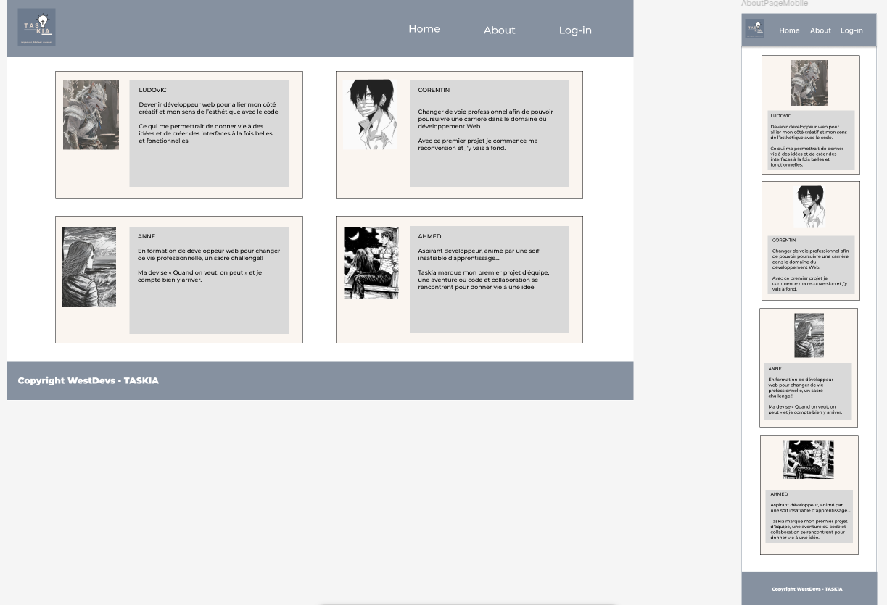

# 🌟 Taskia 🌟

Premier projet réalisé de type "To-Do List" à partir de la troisième semaine de fomation.

La maquette ci-dessous :

<h3>Partie Home<h3>

<h3>Partie Log-in<h3>

<h3>Partie About<h3>

## 📌 Technologies utilisées :

⚡ **Langages :** HTML/CSS, JavaScript.

© Copyright WestDevs - TASKIA
